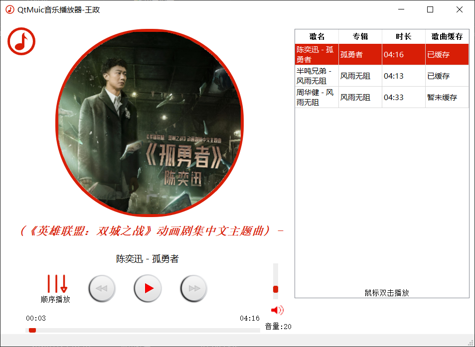
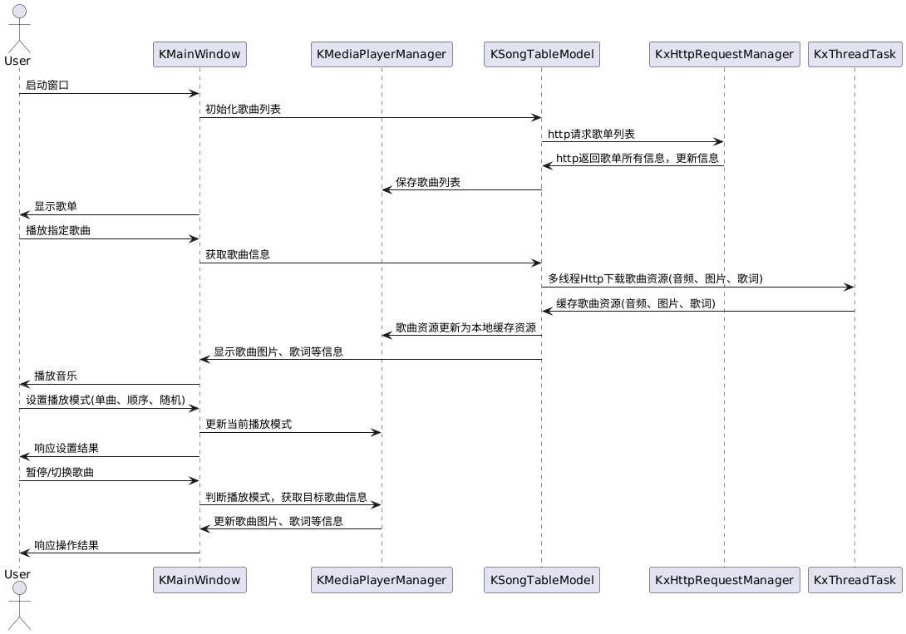

# Qt HTTP音乐播放器

[TOC]

## 0、视频展示

视频文件路径：`src/QtMusicPlay4.mp4`

## 一、项目概述

### 1.1 项目简介

- Qt HTTP音乐播放器是一款基于Qt框架开发的跨平台桌面音乐播放器。该播放器集成了本地音乐播放和在线音乐播放功能，用户可以方便地导入本地音乐文件或添加在线音乐资源进行播放

### 1.2 项目目标

- 基本需求:
- [x] 支持 MP3 格式音乐播放
- [x] 支持基本的播放控制功能，如播放、暂停、上一曲、下一曲
- [x] 支持在线音乐播放，通过 HTTP 请求获取音乐资源
- [x] 支持歌词自动匹配并显示
- [x] 支持专辑图片自动匹配并显示
- [x] 支持音量调节、静音功能。
- [x] 支持播放进度显示,时间显示
- [x] 支持歌曲切换
- 扩展需求:
- [x] 支持拖动进度条调整进度
- [x] 支持专辑图片动画,在播放时可同步旋转
- [x] 支持本地音乐缓存与播放
- [ ] 支持 MP3 以外的格式播放,如WAV、FLAC、AAC等
- [x] 支持播放模式选择，如顺序播放、单曲循环、随机播放等
- [x] 支持最小化托盘

### 1.3 项目范围

项目主要聚焦于开发桌面端的音乐播放器，支持的音乐格式初期为MP3，计划后续添加对WAV、FLAC等格式的支持。播放器支持自动获取在线歌单列表信息，并能够根据用户选择播放在线音乐。此外，播放器还具备基本的播放控制功能，如播放、暂停、上一曲、下一曲等。

## 二、系统架构与设计

### 2.1 架构概述

Qt HTTP音乐播放器采用了MVC（模型-视图-控制器）架构模式，以分离用户界面与业务逻辑，提高应用的可维护性和扩展性。系统架构主要分为以下几个部分：
- **视图层（View）**：用户界面，负责展示数据和接收用户操作。
- **控制层（Controller）**：处理用户输入，通过模型层处理数据，然后更新视图层。
- **模型层（Model）**：数据访问层，包括音乐播放控制和网络数据交互。

### 2.2 模块划分

系统主要模块包括：
- **播放器控制模块（KMediaPlayerManager）**：封装了所有音乐播放控制逻辑，包括加载文件、播放、暂停、音乐播放控制等。
- **音乐资源管理模块（KSongTableModel）**：管理音乐库，支持添加、删除歌曲和创建播放列表。
- **网络通信模块（KxHttpRequestManager）**：负责执行所有网络请求，如下载歌曲、获取歌词和搜索在线资源。
- **用户界面模块（KMainWindow）**：为用户提供操作界面，包括播放控制按钮、音乐列表和播放信息显示。
- **线程处理模块（KThreadTask）**：提供多线程处理功能，包括获取歌曲音乐资源等。

### 2.3 技术选型

选用Qt框架是因为其跨平台特性以及丰富的网络和多媒体处理功能。其中使用QNetworkAccessManager类进行网络请求，QMediaPlayer类进行音乐播放和音量控制，QMediaPlaylist类管理播放列表，QThread实现多线程处理。

## 三、功能实现

### 3.1 基本播放功能

#### 功能介绍

  项目支持基本的音乐播放功能，允许用户通过图形界面控制音乐的播放、暂停、停止，以及跳转到下一曲或上一曲。这提供了一个直观和易于操作的用户界面，使用户能够轻松管理他们的音乐体验。

  #### 技术实现

  - **控件和信号**：使用`QPushButton`控件为每种播放控制功能提供界面。这些按钮的`clicked`信号连接到槽函数，用于控制音乐的播放状态。
  - **音乐播放管理**：`KMediaPlayerManager`类封装了`QMediaPlayer`和`QMediaPlaylist`的接口。该类负责具体的播放控制逻辑，如播放、暂停、停止和跳转歌曲。
  - **播放列表管理**：通过`QMediaPlaylist`管理播放列表，支持添加、删除和重新排序歌曲，以及保存用户的播放列表。

### 3.2 在线音乐支持

  #### 功能介绍

  除了播放本地音乐文件外，应用还支持在线搜索和播放音乐流。这通过集成网络请求处理模块实现，用户可以搜索音乐、播放在线音乐，并下载音乐文件及其歌词。

  #### 技术实现

  - **HTTP请求处理**：`KxHttpRequestManager`模块负责发起和处理所有HTTP请求，这包括音乐搜索、音乐流播放和文件下载。
  - **数据通信**：通过信号和槽机制在`KxHttpRequestManager`和`KSongTableModel`之间进行数据通信。当从网络请求中获取到音乐数据后，这些数据被发送到`KSongTableModel`，后者更新UI展示和数据存储。
  - **歌词和文件下载**：在用户选择特定歌曲时，应用不仅可以流式传输音乐，还可以下载音乐文件和相关的歌词文件到本地，支持离线播放。

### 3.3 高级功能实现

#### 进度条调整

- **功能介绍**：用户可以通过拖动进度条来快速定位音乐播放的任何位置，这不仅提高了用户的交互体验，还允许精确控制音乐播放进度。
- **技术实现**：进度条通过`QSlider`控件实现。`KMediaPlayerManager`负责监听`QMediaPlayer`的`positionChanged`信号，这个信号每当音乐播放位置改变时触发。然后，`KMediaPlayerManager`会发出自定义的`onPositionChanged`信号，`KMainWindow`通过连接到这个信号的槽函数来接收通知，并计算新的滑块位置，实时更新UI的进度条。

#### 专辑图片动画

- **功能介绍**：在音乐播放期间，专辑封面图片会进行旋转动画，创建动态视觉效果，增强用户的听觉与视觉体验。当音乐暂停时，动画也会相应停止，提供直观的反馈。
- **技术实现**：专辑图片的动画通过一个定时器控制，该定时器在接收到`QMediaPlayer::positionChanged`信号时触发。每次信号发出时，图片旋转一个固定角度。使用`QLabel`或自定义的`QWidget`来显示图片，并在其绘图事件中处理旋转逻辑。

#### 本地音乐缓存

- **功能介绍**：支持将在线获取的音乐缓存到本地硬盘，用户可以在没有网络连接的情况下播放之前已下载的音乐，这提高了应用的实用性和访问速度。
- **技术实现**：当用户选择播放音乐时，系统首先检查本地缓存。如果没有缓存，应用将从在线源下载音乐文件，并将其保存到本地磁盘。此操作由后台服务处理，以避免阻塞UI。下载完成后，更新播放器的资源路径以指向本地文件。

#### 最小化托盘

- **功能介绍**：应用支持最小化到系统托盘，允许用户在不关闭应用的情况下释放任务栏空间。这使得应用可以在后台静默运行，而用户仍可通过简单的托盘图标操作来管理其状态。
- **技术实现**：实现这一功能涉及使用`QSystemTrayIcon`来创建托盘图标。托盘图标配有一个上下文菜单，包括恢复和退出等选项。图标的双击事件被配置为恢复应用窗口，而右键菜单提供用户更多控制选项。对于窗口的最小化事件，通过覆盖`closeEvent`方法并改为隐藏窗口来处理，而不是关闭应用。

### 3.4 用户交互设计 

界面右侧为获取的在线歌曲列表

## 四、技术细节

### 4.1 类图分析

详细分析了KMainWindow、KMediaPlayerManager、KSongTableModel等关键类的职责和相互关系，强调了如何通过分层的设计模式降低各模块之间的耦合度。

文件路径：`src/UML_class.png`

### 4.2 时序图分析

通过时序图，展示了从用户发起播放命令到音乐输出的完整流程，包括用户界面如何与后端逻辑交互，以及网络模块如何响应音乐播放请求。

文件路径：`src/UML_Time.png`

## 五、项目挑战与收获

### 5.1 遇到的主要挑战

- 资源请求下载速度慢：通过创建KxThreadTask类，将http请求任务放入线程中处理。
- 槽函数无法接受到对应信号：原因为槽函数参数类型格式不完全匹配，导致无法和信号一一对应。
- http响应处理槽函数接受数据为空：原因为一个信号触发多个槽函数时，党第一个槽函数处理完后传入参数地址已被销毁。

- 歌词解析和显示问题：歌词文件由于为一个长的字符串，首先需要对字符进行拆分为多个子串。然后使用正则表达式，解析其中的时间点，歌曲播放时，根据不同的歌曲进度，匹配对应的歌词进行展示。

### 5.2 项目收获

- 加深对信号与槽函数机制的理解。
- 加深对MVD架构的理解，将不懂的职责划分给不同的类。
- 通过对每个功能模块的划分，对应负责类提供响应的独立接口。

### 5.3 未来展望

- 实现窗口最小化效果
- 优化http请求响应接受效率和体验
- 实现本地音乐播放
- 实现多类型文件播放